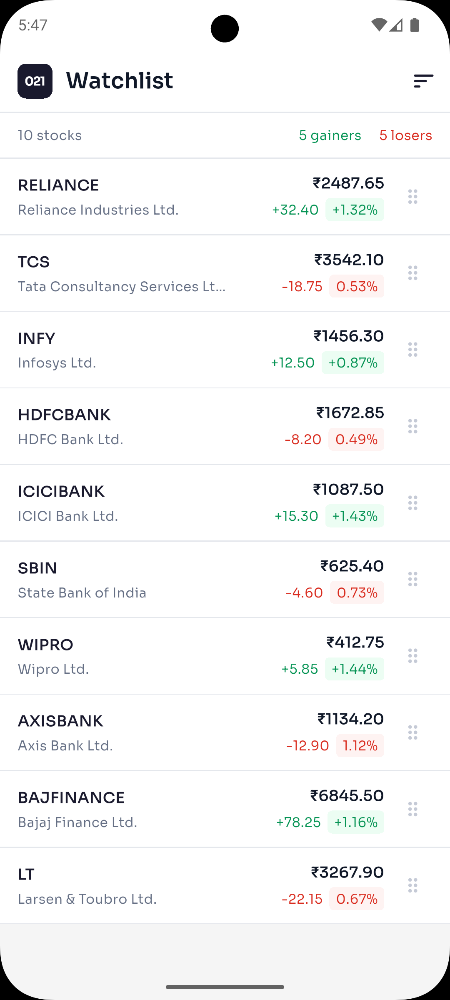
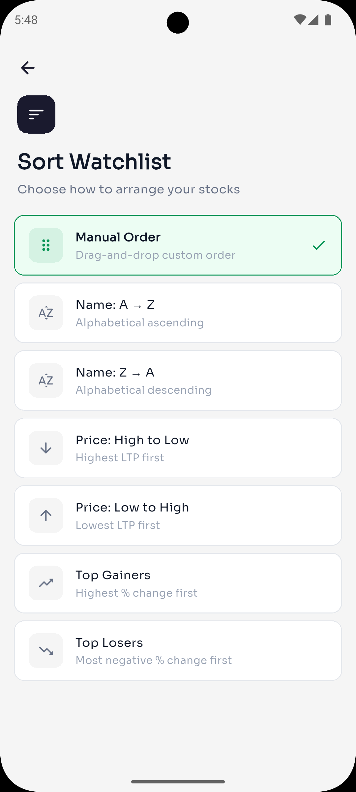

# 021 Trade Watchlist

A Flutter stock watchlist app with drag-and-drop reordering and sorting,
built using the BLoC architecture pattern.

## Screenshots




---

## 1. Approach

### Why BLoC?

I picked BLoC over `setState` or Provider for a few reasons:

- **Strict separation** — UI code never touches business logic. The widget tree
  just dispatches events and renders states. This makes the codebase easy to
  reason about, especially for someone reviewing it for the first time.
- **Testability** — every handler in the Bloc is a pure function from
  `(currentState, event) → newState`. I can test sorting and reordering logic
  without spinning up any widgets.
- **Predictable state flow** — the unidirectional `Event → Bloc → State → UI`
  cycle means there's exactly one place to look when something breaks.

I considered using `Riverpod` but went with `flutter_bloc` since the assignment
specifically called for BLoC. It also has the clearest boundary enforcement
out of the popular state management options.

### How Reordering Works

The drag-and-drop uses Flutter's built-in `ReorderableListView.builder` with
custom drag handles:

1. Default drag handles are disabled (`buildDefaultDragHandles: false`)
2. Each stock tile has a `DragHandle` widget wrapping a `ReorderableDragStartListener`
3. When the user drops a tile, `onReorder` fires with `oldIndex` and `newIndex`
4. The UI dispatches a `WatchlistReordered` event — it never reorders the list itself
5. The Bloc clones the list, adjusts for Flutter's index offset quirk
   (when dragging down, `newIndex` is off by 1), and emits a new state

This keeps all list mutation logic inside the Bloc. The UI is just a projection
of the current state.

---

## 2. Architecture

I went with a feature-first folder structure. Each feature is self-contained
with its own data, domain, and presentation layers:

```
lib/
├── main.dart                              # Entry point
├── app/
│   └── app.dart                           # MaterialApp + root BlocProvider
├── core/
│   ├── constants/
│   │   └── app_colors.dart                # Centralized color palette
│   └── theme/
│       └── app_theme.dart                 # Light theme (Sora + IBM Plex Sans)
└── features/
    └── watchlist/
        ├── data/
        │   └── watchlist_repository.dart   # Hardcoded stock data source
        ├── domain/
        │   ├── models/
        │   │   └── stock_model.dart        # Immutable Stock model (Equatable)
        │   └── enums/
        │       └── sort_type.dart          # Sort criteria enum
        └── presentation/
            ├── bloc/
            │   ├── watchlist_bloc.dart      # Event handlers + sort logic
            │   ├── watchlist_event.dart     # Load, Reorder, Sort events
            │   └── watchlist_state.dart     # Initial, Success, Failure states
            ├── pages/
            │   ├── watchlist_page.dart      # Main screen with ReorderableListView
            │   └── sort_watchlist_page.dart # Sort criteria selection screen
            └── widgets/
                ├── stock_tile.dart          # Individual stock row
                ├── sort_option_tile.dart    # Sort option card
                └── drag_handle.dart         # Drag handle icon
```

**Why this structure?** If I needed to add a second feature (say, a portfolio
tracker), I'd just add `features/portfolio/` with its own data/domain/presentation
layers. Nothing in the watchlist feature would need to change.

---

## 3. State Management

### Event Flow

```
User Action          →  Event                    →  Bloc Handler      →  New State
─────────────────────────────────────────────────────────────────────────────────────
App opens            →  WatchlistLoaded          →  _onLoaded         →  LoadSuccess
Drag & drop tile     →  WatchlistReordered       →  _onReordered      →  LoadSuccess
Tap sort option      →  WatchlistSortRequested   →  _onSortRequested  →  LoadSuccess
Repo throws error    →  (caught in _onLoaded)    →                    →  LoadFailure
```

### Events

| Event | Payload | When it fires |
|-------|---------|---------------|
| `WatchlistLoaded` | none | App startup |
| `WatchlistReordered` | `oldIndex`, `newIndex` | User drops a dragged tile |
| `WatchlistSortRequested` | `SortType` enum | User taps a sort option |

### States

| State | Data | UI shows |
|-------|------|----------|
| `WatchlistInitial` | none | Loading spinner |
| `WatchlistLoadSuccess` | `List<Stock>`, `SortType` | Stock list + summary bar |
| `WatchlistLoadFailure` | `String error` | Error message |

### How Sorting Interacts with Drag & Drop

This was the trickiest part. The Bloc caches the "original" order from the
repository in `_originalStocks`. When sorting:

- **Manual** → restores `_originalStocks`
- **Any other sort** → sorts a copy of `_originalStocks` by the chosen criteria
- **After a drag-and-drop** → the new order becomes the new "original",
  and `activeSortType` resets to `manual`

This means you can sort by gainers, then switch back to manual, and
you'll get the last drag-and-drop order back — not the initial repository order.

---

## 4. Tradeoffs

### Local data instead of API

I used a hardcoded repository (`WatchlistRepository.getWatchlist()`) that
returns a fixed list of 10 Indian stocks. In a real app, this would be an
API call with `async/await` and proper loading states. I kept it synchronous
to focus on the BLoC architecture and reordering logic without the noise of
network error handling, caching, and retry logic.

### Simplified Stock model

The `Stock` model only has 6 fields (id, symbol, companyName, ltp, change,
changePercent). A production model would include things like market cap,
52-week high/low, volume, exchange, etc. I intentionally kept it minimal
so the code stays readable and the assignment scope stays focused.

### UUID-based IDs

Each stock gets a UUID via the `uuid` package. This is overkill for a
10-item hardcoded list, but it makes `ValueKey(stock.id)` reliable for
the `ReorderableListView` — which needs stable, unique keys to track
items during drag operations.

### Immediate-apply sorting

The sort screen applies the selection immediately on tap and pops back,
rather than having a separate "Apply" button. I chose this because it
felt more natural in testing — the user taps what they want, and they're
done. The tradeoff is there's no "cancel" option, but since switching
back to "Manual Order" is one tap away, it's not a real problem.

### No persistent storage

Reordered positions are lost on app restart. In a production app, I'd
use `shared_preferences` or a local database to persist the order.
For this assignment, in-memory state was sufficient to demonstrate
the BLoC pattern.

---

## 5. Design

### Color Palette

I went with a flat, professional light theme instead of the common dark
trading theme. The colors are muted and intentional:

| Role | Color | Hex |
|------|-------|-----|
| Background | Off-white | `#F5F5F5` |
| Cards / AppBar | White | `#FFFFFF` |
| Primary accent | Deep navy | `#1A1A2E` |
| Gain | Muted green | `#079455` |
| Loss | Muted red | `#D92D20` |
| Text primary | Near-black | `#101828` |
| Text secondary | Mid-gray | `#667085` |

### Typography

- **Sora** for headings — geometric, modern, distinctive
- **IBM Plex Sans** for body text — highly legible, professional feel

Both loaded via `google_fonts` at runtime.

---

## Running

```bash
flutter pub get
flutter run
```

Requires Flutter SDK 3.10+ and Dart 3.0+.

## Dependencies

| Package | Purpose |
|---------|---------|
| `flutter_bloc` | BLoC state management |
| `equatable` | Value equality for events, states, models |
| `uuid` | Unique IDs for stock items |
| `google_fonts` | Sora + IBM Plex Sans typography |

## What I'd Add Next

- Search and filter by symbol/company name
- WebSocket-based live price streaming
- Multiple watchlist tabs
- Persistent storage for custom order
- Swipe-to-delete with undo snackbar